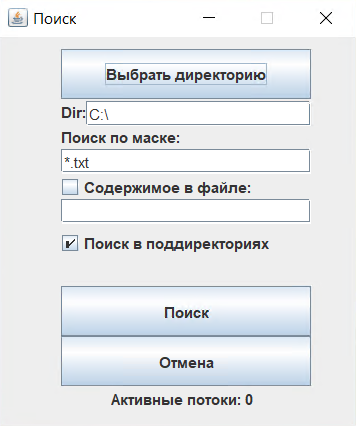
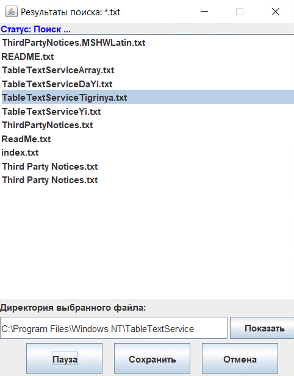

# FileSearching

<p align="center">
  
   
</p>

Реализация многопоточного поиска файлов по маске.

## Building

Для компиляции пректа необходим JDK (Java Development Kit) версии не ниже 10, который можно скачать на [официальном сайте](https://www.oracle.com/java/technologies/javase-downloads.html).
```shell
> mkdir build
> javac -encoding UTF-8 -cp ./src -d ./build src/Main.java
```

## Usage

```shell
> java -cp ./build Main
```

## License

[Apache-2.0 License](LICENSE)